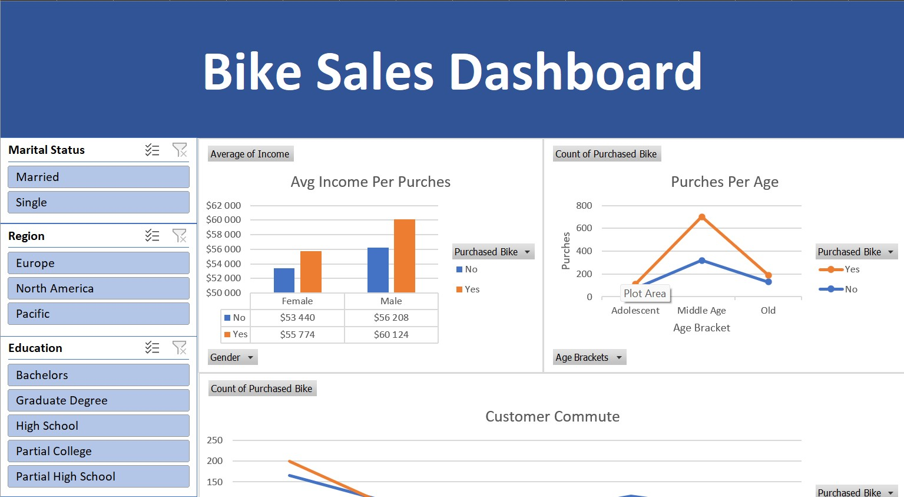

# Bikes data (Excel)
 
В этом проекте я работал с данными **bike_buyers** в Excel. Для очистки и анализа данных. Шаги, которые я выполнил:

### Очистка данных:

1. **Удаление дубликатов**: Убедился, что в наборе данных нет дублирующихся записей.
2. **Стандартизация данных**: Привёл данные к единому формату и структуре для обеспечения консистентности.
3. **Обработка пустых и null полей**: Удалил строки и поля с пустыми или null значениями для сохранения целостности данных.
4. **Удаление ненужных колонок**: Убрал колонки, которые не были нужны для анализа, чтобы оптимизировать набор данных.

### Анализ данных:

Создал несолколько сводных таблиц, графиков и dashboard.

Source: <a>https://www.kaggle.com/datasets/sadiqshah/bike-sales-in-europe?resource=download</a>